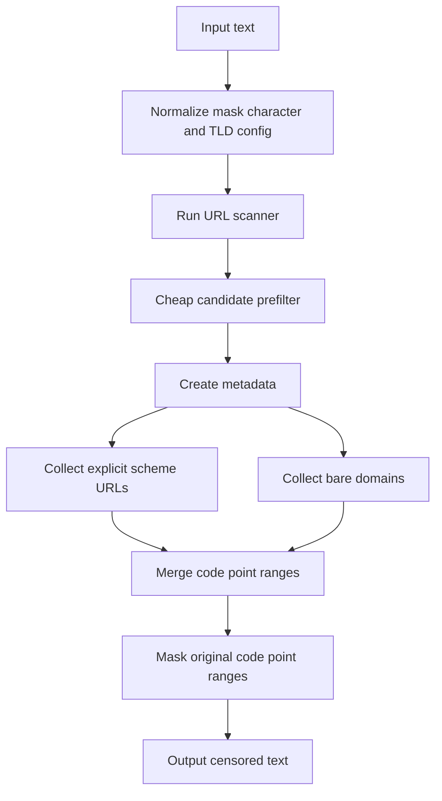
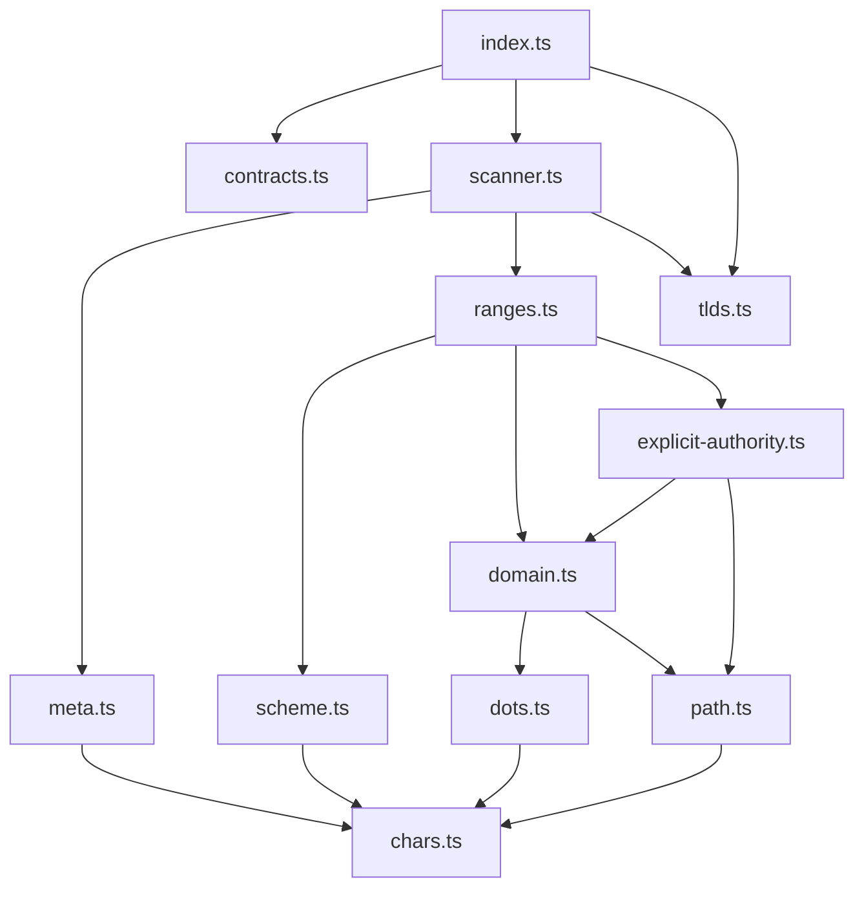

# URL Filter Architecture

## Goals

The package provides composable URL censoring while preserving existing URL matching behavior. The implementation is split into small parser modules so each rule family can be changed without turning the filter into a framework.

The matcher keeps two URL paths intentionally separate:

- bare domains use the configured TLD list, which keeps prose and unknown internal names from being masked by default;
- explicit-scheme URLs are treated as stronger evidence, so they can match localhost, ports, IPv6, userinfo, IDN or emoji hosts, and unknown TLDs.

## Public API

`createUrlFilter(config?)` creates a URL censor with optional `maskChar` and `tlds` settings.

The default `filter` export is a shared instance with the default TLD list. `urlFilter(config?)` is an alias for `createUrlFilter(config?)`.

`UrlFilterConfig` supports:

- `maskChar`: the replacement character passed through core mask normalization;
- `tlds`: a custom bare-domain TLD allowlist. A non-empty custom list replaces the default list.

## High-Level Flow

## Module Map

## File Responsibilities

| File                        | Responsibility                                                                                                     | Out of scope                          |
| --------------------------- | ------------------------------------------------------------------------------------------------------------------ | ------------------------------------- |
| `src/index.ts`              | Public entrypoint, public exports, and censor wrapper orchestration.                                               | Parser details or matching policy.    |
| `src/contracts.ts`          | Public types and constants.                                                                                        | Internal parser types.                |
| `src/scanner.ts`            | URL scanner factory, range scanner output, boolean checks, sink streaming, and cheap clean-text prefilter.         | Low-level parser rules.               |
| `src/tlds.ts`               | Default TLDs and TLD normalization.                                                                                | Host parsing or URL range collection. |
| `src/chars.ts`              | Shared character sets, punctuation policy, lookalike map, and static parser character arrays.                      | Parser control flow.                  |
| `src/meta.ts`               | Source metadata, raw and skeleton views, and low-level consume helpers.                                            | URL-specific matching policy.         |
| `src/scheme.ts`             | Real, split, hxxp, and defanged scheme parsing.                                                                    | Host or path parsing.                 |
| `src/dots.ts`               | Real, Unicode, bracketed, word, and Russian defanged dot parsing.                                                  | TLD validation.                       |
| `src/domain.ts`             | Bare domain labels, separators, TLD validation, and domain path tails.                                             | Explicit authority-only host rules.   |
| `src/explicit-authority.ts` | Explicit-scheme authority parsing for localhost, ports, IPv6, userinfo, underscores, IDN, emoji, and unknown TLDs. | Bare-domain allowlist policy.         |
| `src/path.ts`               | Path, query, fragment continuation and trailing prose trimming.                                                    | Scheme or TLD parsing.                |
| `src/ranges.ts`             | Internal range collection facade and range merging.                                                                | Public API exports.                   |

## Matching Strategy

The parser reads the original input as code points and builds parallel metadata arrays. `raw` text is NFKC-normalized and lowercased through `@textfilters/core`. `skeleton` additionally folds common Cyrillic and Latin lookalikes so obfuscated hosts and schemes can be compared against ASCII rules.

Ranges always point back to the original code point indexes. This keeps masking length-preserving and avoids recalculating offsets after normalization.

Real URL schemes match `http` and `https`. Obfuscated schemes match `hxxp`, split-letter forms such as `h t t p`, and defanged delimiters such as `[:]//` or `[://]`.

Bare domains are parsed from labels separated by real, Unicode, or defanged dots. They require a configured TLD unless the TLD is punycode-like.

Explicit authorities are parsed after a scheme and can use broader host syntax than bare domains. That path accepts localhost, ports, IPv6 bracket hosts, userinfo, underscores, IDN and emoji labels, and unknown TLDs.

Path, query, and fragment continuation is shared by bare and explicit URL parsing. It trims trailing prose punctuation while keeping balanced path delimiters when they are part of the URL.

## Explicit Scheme vs Bare Domain

Examples:

- `https://example.unknown/path` should match because the scheme is explicit.
- `example.unknown/path` should not match by default because bare domains require configured TLDs.
- `http://localhost:3000/admin` should match because localhost is valid after an explicit scheme.
- `svc.internal` should match only with custom TLD config such as `{ tlds: ["internal"] }`.

## Range And Masking Rules

The package collects code point ranges before masking. Clearly clean text is
rejected by a cheap prefilter before metadata arrays are built. Explicit-scheme
URLs are collected first because they can validate unknown TLDs and wider
authority forms. Bare-domain ranges are collected after that. Ranges are merged
and deduplicated before being passed to core masking.

The public `createUrlScanner()` wrapper returns code point ranges in a shape
that can be used by the shared core range scanner contract. It also exposes
`check(input)` for boolean checks and `scan(input, sink)` for allocation-aware
range streaming with early stop support. Inputs may include shared-style text
hints such as dot, slash, colon, and non-ASCII markers so clearly clean text can
skip parser metadata allocation. The existing `createUrlFilter()`, `urlFilter()`,
and `filter` wrappers use that scanner while preserving their public censor
behavior.

Trailing punctuation and glued prose are trimmed before a range is emitted. Surrounding quotes and brackets stay outside explicit authority ranges unless they are structurally part of the URL, such as IPv6 brackets or balanced path parentheses.

Masking is idempotent because ranges are collected from the original text before any replacement happens. Masking preserves input length because replacement happens per original code point range.

## Change Guide

| Change                                    | Primary files                                      |
| ----------------------------------------- | -------------------------------------------------- |
| Add a new TLD behavior                    | `src/tlds.ts` + public API tests                   |
| Change defanged dot behavior              | `src/dots.ts` + public API tests                   |
| Change hxxp/scheme parsing                | `src/scheme.ts` + public API tests                 |
| Change explicit host handling             | `src/explicit-authority.ts` + public API tests     |
| Change trailing punctuation/path behavior | `src/path.ts` + public API tests                   |
| Change source normalization/lookalikes    | `src/meta.ts` or `src/chars.ts` + public API tests |
| Change scanner wrapping or prefiltering   | `src/scanner.ts` + scanner tests                   |

## Safety Rules

- Do not expose parser internals as public API.
- Do not make user config accept arbitrary regex.
- Do not change bare-domain matching without compatibility tests.
- Do not update ranges after masking.
- Keep tests public-API oriented.
