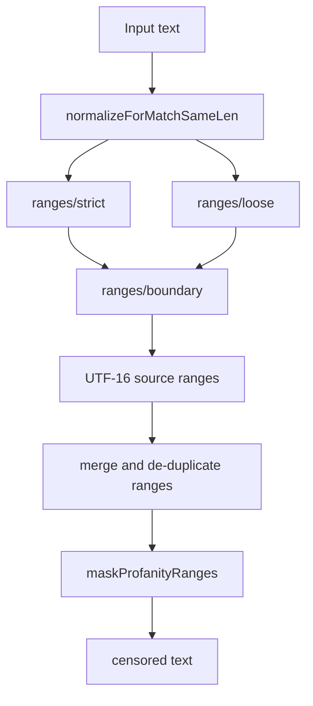
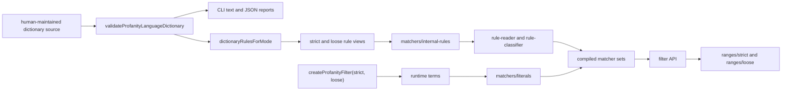
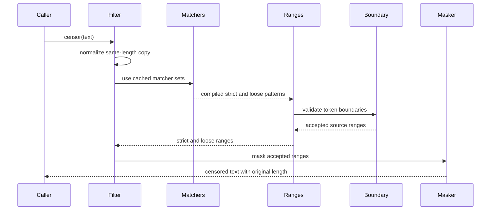
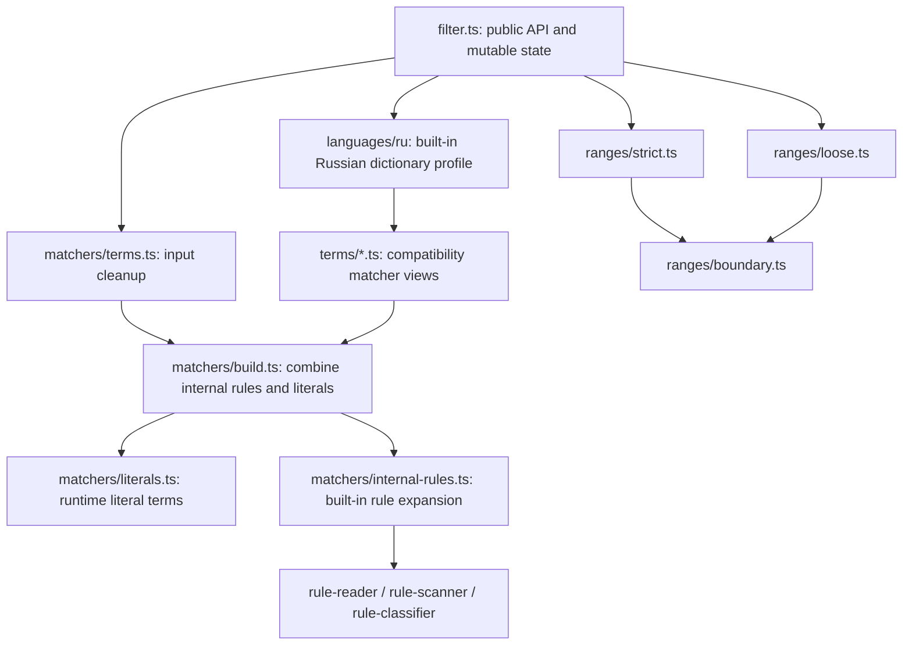

# Profanity Filter Architecture

This package keeps the public dictionary API intentionally small: runtime terms are
normalized literals, while the bundled Russian profanity dictionary may use
controlled internal rules. That split keeps custom dictionaries predictable and
avoids the raw-regex edge cases that previously made matching, normalization, and
boundary checks hard to reason about.

## Compatibility And Intentional Changes

The public package keeps the built-in Russian corpus behavior covered
by compatibility tests. Those tests lock strict roots, loose separator handling,
latin homoglyph folding, `ё`/`е` folding, zero-width handling, false-positive
guards, user repro cases, length preservation, idempotency, and runtime dictionary
replacement.

Intentional public-package changes:

- Runtime dictionary terms are normalized literals, not arbitrary regular expressions.
- Built-in package-owned rules use an internal compiler that is not exposed through the public API.
- The filter exposes stable `name: "profanity"`.
- The filter exposes `check(text): boolean` for boolean-only detection.
- Masking preserves JavaScript string length for astral code points.

## High-Level Flow

The matcher works on a normalized copy of the text, but all match ranges are
kept as UTF-16 offsets into the original string. Normalization must remain
same-length; see [invariants.md](invariants.md) for the maintained transform
list.

## Dictionary Boundary

Runtime terms are not regular expressions. A term such as `foo|bar` matches the
literal text `foo|bar`, not `foo` or `bar`. Escaped punctuation is accepted for
compatibility with old literal spellings, so `foo\\.bar` is treated as the literal
term `foo.bar`.

The built-in Russian dictionary is different. It is package-owned,
human-maintained rule data that is compiled internally and covered by corpus
tests. Each rule owns its source, optional taxonomy metadata, and match
behavior. Strict and loose are compiled matcher views, not separate dictionaries
or serialized matcher output. This allows compact expressions for Russian
morphology without exposing arbitrary user regex semantics.

Reviewed loose rules may also opt into `hyphenTail` metadata from the source
dictionary. That keeps language-specific compound trimming decisions in data
while the runtime range code only applies the generic compiled-rule signal.

The validator is the authoring gate for language dictionaries. It rejects
missing taxonomy, generated matcher metadata, duplicate ids and sources,
unsupported match options, invalid source patterns, suspicious id/category
pairings, and source formatting mistakes before the dictionary reaches compiled
runtime views. The CLI is a thin JSON-file wrapper around that same validator;
it does not compile matchers or change runtime behavior.

The source tree is prepared for language profiles, but this package does not
implement multi-language selection, external language packs, or a public pack API
yet. The only built-in profile is Russian.

## Strict And Loose Matching

Strict matching has three small passes because each covers a different literal
shape:

| Pass        | Why It Exists                                                                                                                      |
| ----------- | ---------------------------------------------------------------------------------------------------------------------------------- |
| Word tokens | Regular word terms such as `bad` or built-in Russian stems.                                                                        |
| Symbol runs | Symbol-only runtime literals such as `(` or `.`.                                                                                   |
| Phrases     | Only runtime literals that mix word characters with punctuation, such as `foo.bar` or `a?`; built-in strict rules stay token-only. |

A strict runtime word term must cover the full token after normalization, so
`bad` does not match `_bad`, `-bad`, or `badminton`.

Loose matching allows separators between letters, which covers common obfuscation
such as `п-и-з-д-е-ц` or `х/у/й`. Loose matches still pass token-boundary checks
before masking, so a prefix inside a larger token is rejected unless the match
actually covers the relevant token span.

## Why The Code Is Split This Way

The implementation is split by reading level:

The top-level filter has lifecycle code only; matcher modules compile rules;
range modules decide what parts of text can be masked.

| File                                      | Responsibility                                                        |
| ----------------------------------------- | --------------------------------------------------------------------- |
| `src/filter.ts`                           | Public API lifecycle and orchestration.                               |
| `src/normalization/text.ts`               | Same-length normalization and code-point helpers.                     |
| `src/constants/latin-to-cyr.ts`           | Shared homoglyph map used by normalization.                           |
| `src/matchers/terms.ts`                   | Runtime term cleanup and deduplication.                               |
| `src/matchers/build.ts`                   | Final matcher-set assembly from internal rules and literals.          |
| `src/matchers/compile.ts`                 | Small `RegExp` compile/test wrapper.                                  |
| `src/matchers/literals.ts`                | Runtime literal dictionary compilation.                               |
| `src/matchers/internal-rules.ts`          | Built-in loose rule separator expansion.                              |
| `src/matchers/rule-reader.ts`             | Reads controlled rule sources into atoms.                             |
| `src/matchers/rule-scanner.ts`            | Low-level controlled rule scanning and alternative splitting helpers. |
| `src/matchers/rule-classifier.ts`         | Decides which controlled atoms are word-like.                         |
| `src/languages/profanity.ts`              | Generic language dictionary to matcher-view conversion.               |
| `src/languages/validation.ts`             | Source dictionary authoring validator and issue contract.             |
| `src/cli/validate-language-dictionary.ts` | JSON dictionary validator CLI and text/JSON report formatting.        |
| `src/languages/ru/*`                      | Built-in Russian profanity dictionary/profile data.                   |
| `src/ranges/strict.ts`                    | Strict range collection.                                              |
| `src/ranges/loose.ts`                     | Loose range collection.                                               |
| `src/ranges/patterns.ts`                  | Shared global regexp iteration with zero-width protection.            |
| `src/ranges/boundary.ts`                  | Token-boundary validation.                                            |
| `src/token-ranges.ts`                     | Shared UTF-16 token and masking helpers.                              |
| `src/terms/*.ts`                          | Compatibility exports for compiled built-in matcher views.            |

The important design decision is that user input never enters the internal rule
compiler. That keeps the public API stable, prevents user-provided zero-width or
lookaround-heavy regexes from controlling the global matching loops, and removes
the need for raw validators that tried to preserve JavaScript regex semantics
after text normalization.

## Change Guide

| Change                                     | Start Here                                                       |
| ------------------------------------------ | ---------------------------------------------------------------- |
| Add a runtime dictionary behavior          | `src/matchers/literals.ts` and tests.                            |
| Add a built-in Russian corpus rule         | `src/languages/ru/profanity/` and corpus tests.                  |
| Change separator handling for built-ins    | `src/matchers/internal-rules.ts`.                                |
| Change token acceptance or false positives | `src/ranges/boundary.ts`.                                        |
| Change masking length behavior             | `src/token-ranges.ts`.                                           |
| Change homoglyph or fullwidth folding      | `src/normalization/text.ts` and `src/constants/latin-to-cyr.ts`. |

## Adding New Built-In Rules

1. Add the narrowest rule source to the matching family file in
   `src/languages/ru/profanity/`.
   Choose `match.strict`, `match.loose`, or both based on the behavior being
   added; strict and loose are compiled matcher modes, not separate source
   dictionaries. Do not add generated matcher ids or per-mode ordering fields to
   the dictionary.
2. Add a positive corpus case in the relevant corpus spec under `tests/`.
3. Add a false-positive case when the rule could overlap with common neutral
   words.
4. Run the full package check before publishing the branch.

Runtime dictionary examples should be added as literal terms. Do not use the
built-in rule syntax for tenant or request-level dictionaries.
