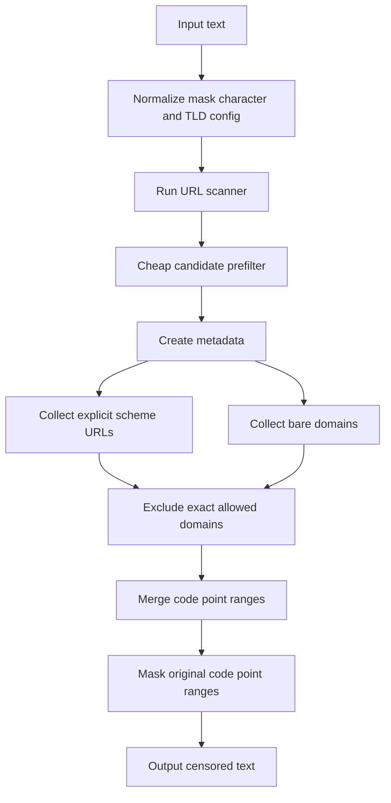
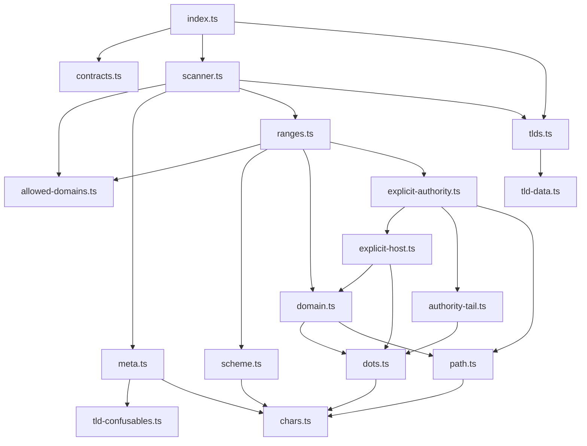

# URL Filter Architecture

## Goals

The package provides composable URL censoring while preserving existing URL matching behavior. The implementation is split into small parser modules so each rule family can be changed without turning the filter into a framework.

The matcher keeps two URL paths intentionally separate:

- bare domains use the complete embedded IANA root-zone snapshot unless a
  non-empty custom TLD list is configured, which keeps unknown internal names
  from being masked by default;
- explicit-scheme URLs are treated as stronger evidence, so they can match localhost, ports, IPv6, userinfo, IDN or emoji hosts, and unknown TLDs.

## Public API

`createUrlFilter(config?)` creates a URL censor with optional `maskChar`, `tlds`, and `allowedDomains` settings.

The default `filter` export is a shared instance with the default TLD list. `urlFilter(config?)` is an alias for `createUrlFilter(config?)`.

`UrlFilterConfig` supports:

- `maskChar`: the replacement character passed through core mask normalization;
- `tlds`: a custom bare-domain TLD allowlist. A non-empty custom list replaces the default list.
- `allowedDomains`: case-insensitive exact hostnames excluded from filter and scanner results after parsing.

`allowedDomains` is a synchronous configuration snapshot. Consuming
applications own external loading, validation, caching, and refresh behavior.
Refreshing the snapshot creates a new filter or scanner instance. Exact-host
matching does not trust subdomains or cross-script lookalikes, and invalid
entries fail closed.

## High-Level Flow

## Module Map

## File Responsibilities

| File                        | Responsibility                                                                                             | Out of scope                               |
| --------------------------- | ---------------------------------------------------------------------------------------------------------- | ------------------------------------------ |
| `src/index.ts`              | Public entrypoint, public exports, and censor wrapper orchestration.                                       | Parser details or matching policy.         |
| `src/contracts.ts`          | Public types and constants.                                                                                | Internal parser types.                     |
| `src/scanner.ts`            | URL scanner factory, range scanner output, boolean checks, sink streaming, and cheap clean-text prefilter. | Low-level parser rules.                    |
| `src/tlds.ts`               | Default TLD selection and custom TLD normalization.                                                        | Host parsing or URL range collection.      |
| `src/tld-data.ts`           | Generated ASCII and decoded-IDN IANA root-zone snapshot.                                                   | Runtime parsing policy.                    |
| `src/tld-confusables.ts`    | Generated Unicode confusables subset and explicitly ambiguous TLD glyphs.                                  | General URL normalization policy.          |
| `src/allowed-domains.ts`    | Exact allowed-domain normalization and parsed-host comparison.                                             | Network loading, caching, or suffix trust. |
| `src/chars.ts`              | Shared character sets, punctuation policy, lookalike map, and static parser character arrays.              | Parser control flow.                       |
| `src/meta.ts`               | Source metadata, raw and skeleton views, and low-level consume helpers.                                    | URL-specific matching policy.              |
| `src/scheme.ts`             | Real, split, hxxp, and defanged scheme parsing.                                                            | Host or path parsing.                      |
| `src/dots.ts`               | Real, Unicode, bracketed, word, and Russian defanged dot parsing.                                          | TLD validation.                            |
| `src/domain.ts`             | Bare domain labels, separators, TLD validation, and domain path tails.                                     | Explicit authority-only host rules.        |
| `src/explicit-authority.ts` | Explicit-scheme authority orchestration and final range construction.                                      | Low-level host or tail parsing.            |
| `src/explicit-host.ts`      | Localhost, port, IPv6, userinfo, underscore, IDN, emoji, and unknown-TLD host parsing.                     | Trailing prose and path-tail recovery.     |
| `src/authority-tail.ts`     | Authority boundary trimming, glued prose detection, and spaced/defanged continuation checks.               | Host validity or bare-domain TLD policy.   |
| `src/path.ts`               | Path, query, fragment continuation and trailing prose trimming.                                            | Scheme or TLD parsing.                     |
| `src/ranges.ts`             | Internal range collection facade and range merging.                                                        | Public API exports.                        |

## Matching Strategy

The parser reads the original input as code points and builds parallel metadata arrays. `raw` text is NFKC-normalized and lowercased through `@textfilters/core`. `skeleton` additionally folds common Cyrillic and Latin lookalikes so obfuscated hosts and schemes can be compared against ASCII rules. Token alphanumerics and host-label characters are classified separately: combining marks remain label content, while scheme and defanged-dot word parsers may skip them as obfuscation separators between letters or immediately before a delimiter or token boundary.

TLD validation has a separate finite-pattern matcher based on Unicode
confusables. It compares alternative mappings with memoized intersection
instead of enumerating or truncating combinations, including legacy mappings
and source-code-point readings that differ from lowercase compatibility
normalization. An unknown candidate that compatibility-folds to plain ASCII is
accepted only when its per-code-point pattern matches the configured TLD set
while using at least one original-source Unicode reading; other positions may
retain their normalized alternatives. Plain ASCII and unsupported compatibility
forms remain rejected. The same source-aware matcher is used when deciding
whether a label continues an already-complete host. Explicit ASCII digit targets
retain their `0`/`o` and `1`/`l` compatibility alternatives only when the source
glyph at the substituted position provides that reading.
Default and custom TLD-set patterns are preindexed by reachable first and last
skeleton boundaries and output-length intervals, with a bounded per-set result
cache for repeated candidates. Custom indexes are weakly held and refreshed
once per scan if a low-level caller changes the set contents.
It is applied only to the final bare-domain label, which keeps broader host and
scheme normalization unchanged while recognizing cross-script suffix spellings
that resolve to a configured delegated TLD.

Ranges always point back to the original code point indexes. This keeps masking length-preserving and avoids recalculating offsets after normalization.

Real URL schemes match `http` and `https`. Obfuscated schemes match `hxxp`, split-letter forms such as `h t t p`, and defanged delimiters such as `[:]//` or `[://]`.

Bare domains are parsed from labels separated by real, Unicode, or defanged
dots. They require a delegated TLD from the embedded IANA snapshot, a TLD from
an explicit non-empty custom list, a Unicode-confusable spelling resolving to
one of those TLDs, or a punycode-like TLD. Custom lists without any non-empty
normalized entries fall back to the embedded snapshot. Plain ASCII suffixes
that only collide with a decoded IDN skeleton remain unknown. A
whitespace-wrapped U+2022 list bullet between two repeated standalone words is
prose, including at sentence boundaries; complete hosts before unrelated text
after whitespace-wrapped dot forms or right-spaced single-character dots and
continuations with repeated delegated-suffix or URL-tail evidence remain
detectable.
Capitalized delegated suffix words followed by more prose stay outside a
two-label candidate after a literal sentence dot and optional closing or clause
punctuation, including following sentence periods, while lowercase or URL-tail
evidence remains detectable. If that
prose follows an already-complete host, only the completed host is emitted.
Unsupported trailing combining marks do not invalidate an otherwise delegated
TLD prefix, but a prefix recovered before a remaining mark cannot inherit an
exact-host allowlist entry.

Explicit authorities are parsed after a scheme and can use broader host syntax than bare domains. That path accepts localhost, ports, IPv6 bracket hosts, userinfo, underscores, IDN and emoji labels, and unknown TLDs. A combining mark immediately before a scheme does not hide that explicit URL.

Allowed-domain checks use parsed hostname labels, not the full URL range. NFKC,
case, recognized dot variants, zero-width marks, and a trailing DNS root dot
are normalized. Parser skeletons are deliberately excluded from trust
decisions so visually similar cross-script hostnames cannot inherit an ASCII
domain exception. Unicode and punycode spellings remain separate configuration
entries. Defanged dots still resolve to the same parsed labels.

Path, query, and fragment continuation is shared by bare and explicit URL parsing. It trims trailing prose punctuation while keeping balanced path delimiters when they are part of the URL.

## Explicit Scheme vs Bare Domain

Examples:

- `https://example.unknown/path` should match because the scheme is explicit.
- `example.unknown/path` should not match by default because bare domains require configured TLDs.
- `http://localhost:3000/admin` should match because localhost is valid after an explicit scheme.
- `svc.internal` should match only with custom TLD config such as `{ tlds: ["internal"] }`.

## Range And Masking Rules

The package collects code point ranges before masking. Clearly clean text is
rejected by a cheap prefilter before metadata arrays are built. Explicit-scheme
URLs are collected first because they can validate unknown TLDs and wider
authority forms. Bare-domain ranges are collected after that. Exact allowed
domains are skipped while the parser cursor still advances past the complete
URL. Remaining ranges are merged and deduplicated before being passed to core
masking.

The public `createUrlScanner()` wrapper returns code point ranges in a shape
that can be used by the shared core range scanner contract. It also exposes
`check(input)` for boolean checks and `scan(input, sink)` for allocation-aware
range streaming with early stop support. Inputs may include shared-style text
hints such as dot, slash, colon, and non-ASCII markers so clearly clean text can
skip parser metadata allocation. The existing `createUrlFilter()`, `urlFilter()`,
and `filter` wrappers use that scanner while preserving their public censor
behavior.

Trailing punctuation and glued prose are trimmed before a range is emitted. Surrounding quotes and brackets stay outside explicit authority ranges unless they are structurally part of the URL, such as IPv6 brackets or balanced path parentheses.

Masking is idempotent because ranges are collected from the original text before any replacement happens. Masking preserves input length because replacement happens per original code point range.

## Change Guide

| Change                                  | Primary files                                      |
| --------------------------------------- | -------------------------------------------------- |
| Update delegated TLD data               | `src/tld-data.ts` + public API tests               |
| Update TLD confusable data              | `src/tld-confusables.ts` + public API tests        |
| Add a new TLD behavior                  | `src/tlds.ts` + public API tests                   |
| Change defanged dot behavior            | `src/dots.ts` + public API tests                   |
| Change hxxp/scheme parsing              | `src/scheme.ts` + public API tests                 |
| Change explicit host handling           | `src/explicit-host.ts` + public API tests          |
| Change authority/prose boundaries       | `src/authority-tail.ts` + public API tests         |
| Change path/query/fragment tails        | `src/path.ts` + public API tests                   |
| Change source normalization/lookalikes  | `src/meta.ts` or `src/chars.ts` + public API tests |
| Change scanner wrapping or prefiltering | `src/scanner.ts` + scanner tests                   |
| Change allowed-domain behavior          | `src/allowed-domains.ts` + public API tests        |

## Safety Rules

- Do not expose parser internals as public API.
- Do not make user config accept arbitrary regex.
- Do not change bare-domain matching without compatibility tests.
- Do not update ranges after masking.
- Keep tests public-API oriented.
- Do not use lookalike skeleton folding for allowed-domain trust decisions.
